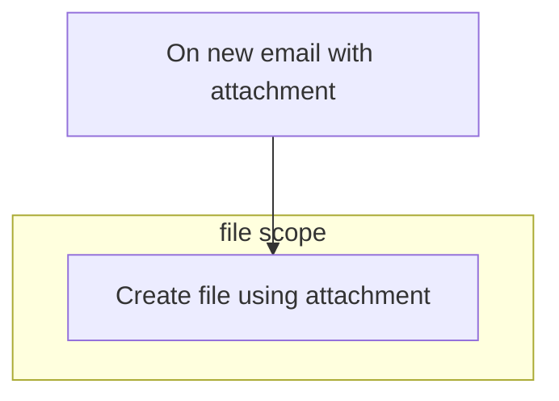

**On new email with attachment**
1. setup subject filter, from filter, etc

**Create file using attachment**
1. File Name: formatDateTime(utcNow(),"yyyyMMdd")Attachment Name
2. File Content: Attachment Content
