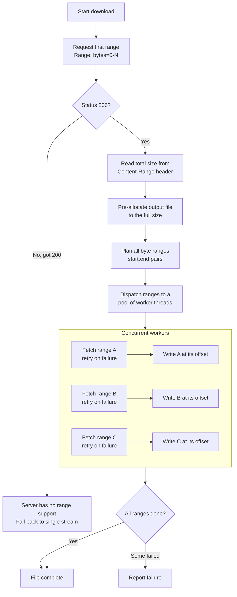

# Downloading a File with Concurrent Partial Downloads

A guide to downloading a single large file faster by fetching several
pieces of it at the same time. This document explains the *concept* and
the moving parts; the code snippets are illustrative, not tied to any
particular library or service.

---

## What problem does this solve?

A normal download opens one connection and reads the file from start to
finish. When a single connection is slow — because the server throttles
per-connection throughput, or network latency dominates — the file arrives
only as fast as that one stream allows, no matter how much spare bandwidth
you have.

**Concurrent partial downloads** split the file into byte ranges and fetch
several ranges at once over separate connections. The pieces are written
to their correct positions in the output file and reassembled into the
complete file. Because the slow parts (latency, per-connection limits)
overlap instead of stacking up, the total time drops.

> It does not make a single connection faster. It wins by running several
> connections in parallel so their wait times overlap.

---

## The key enabler: HTTP range requests

The whole technique rests on one HTTP feature: a client can ask for *part*
of a file instead of the whole thing, using the `Range` header.

```
GET /path/to/file
Range: bytes=0-1048575
```

A server that supports this responds with:

- Status `206 Partial Content` (instead of `200 OK`)
- A `Content-Range` header describing what was returned and the total size:

```
HTTP/1.1 206 Partial Content
Content-Range: bytes 0-1048575/52428800
Content-Length: 1048576
```

That `/52428800` at the end is the **total file size**. This is the single
most important piece of information: once you know the total size, you can
plan every range in advance.

**Always confirm range support first.** If the server ignores the `Range`
header and returns `200 OK` with the entire body, it does not support
partial downloads and you must fall back to a plain single-stream download.

---

## The four building blocks

### 1. Discover the total size

Issue one range request (for the first piece) and read the total size from
the `Content-Range` header. Reuse the bytes you just received so you don't
fetch that first piece twice.

```python
def probe_total_size(url):
    headers = {"Range": "bytes=0-{}".format(RANGE_SIZE - 1)}
    response = get(url, headers=headers)

    if response.status != 206:
        return None, response.body   # server ignored Range -> no support

    # Content-Range looks like: "bytes 0-1048575/52428800"
    total = int(response.header("Content-Range").split("/")[-1])
    return total, response.body
```

### 2. Plan the ranges

Knowing the total size, compute a list of `(start, end)` byte ranges that
cover the file. Each range is one unit of parallel work.

```python
def plan_ranges(total_size, range_size, already_have):
    ranges = []
    pos = already_have            # skip the first piece we already fetched
    while pos < total_size:
        end = min(pos + range_size - 1, total_size - 1)
        ranges.append((pos, end))
        pos = end + 1
    return ranges
```

### 3. Fetch each range (with retry)

A worker fetches one range. Because each range is an independent request,
a transient failure only costs *that* range — retry it with a short,
growing (exponential) backoff instead of restarting the whole download.

```python
def fetch_range(url, start, end):
    headers = {"Range": "bytes={}-{}".format(start, end)}

    for attempt in range(1, MAX_RETRIES + 1):
        try:
            response = get(url, headers=headers)
            if response.status in (200, 206):
                return start, response.body
            raise TransferError("unexpected status")
        except TransientError:
            if attempt == MAX_RETRIES:
                raise
            sleep(BACKOFF_BASE * (2 ** (attempt - 1)))  # 1s, 2s, 4s, ...
```

### 4. Write each piece at the right offset

This is what makes reassembly trivial. **Pre-allocate** the output file to
the full size, then have each worker write its piece at its own offset.
There is no "append in order" step and no need to hold the whole file in
memory.

```python
def write_at(file_handle, offset, data, lock):
    with lock:                 # one shared handle -> serialize the seeks
        file_handle.seek(offset)
        file_handle.write(data)
```

> **Why a lock?** When many threads share one file handle, they also share
> one file position. Guarding `seek` + `write` with a lock keeps a second
> thread from moving the position between another thread's seek and write.
> (Positioned-write APIs that take an explicit offset can avoid the lock,
> but seek-under-lock is simple and portable, and the network — not the
> disk — is the bottleneck anyway.)

---

## Putting the pieces together

The driver discovers the size, plans the ranges, pre-allocates the file,
then hands the ranges to a pool of workers that fetch and write
concurrently.

```python
def download(url, output_path):
    total, first_piece = probe_total_size(url)

    if total is None:
        save(output_path, first_piece)        # no range support: fallback
        return

    preallocate(output_path, total)           # create a file of full size
    lock = Lock()

    with open(output_path, "r+b") as f:
        write_at(f, 0, first_piece, lock)      # the piece we already have

        def worker(byte_range):
            start, end = byte_range
            offset, data = fetch_range(url, start, end)
            write_at(f, offset, data, lock)

        ranges = plan_ranges(total, RANGE_SIZE, len(first_piece))
        run_in_parallel(worker, ranges, max_workers=MAX_WORKERS)
```

---

## How it flows



---

## Choices and trade-offs

| Decision | Guidance |
|---|---|
| **Range size** | Larger ranges = fewer requests but coarser retry/parallelism. A few MB per range is a common starting point. |
| **Worker count** | More workers overlap more latency, but each uses a connection and holds its range in memory. Match it to the server's tolerance and your memory budget. |
| **Memory** | Reading each range fully into memory bounds usage at `workers x range size`. Stream to disk instead if ranges are large. |
| **Retry** | Retry each range independently with exponential backoff. Only a failed range is repeated, never the whole file. |
| **Resume** | Because writes are positioned, you *can* support resume by tracking which ranges completed — but pre-allocating and restarting is simpler if a run fails. |
| **Fallback** | Always handle the "server returned 200" case by downloading normally. Not every server supports ranges. |
| **Ordering** | Pieces can arrive in any order — positioned writes make order irrelevant. |

### When it helps and when it does not

- **Helps:** large files, per-connection throttling, high-latency links,
  servers that allow many concurrent connections.
- **Doesn't help (or hurts):** small files, servers that serialize or rate-
  limit concurrent requests, or links where one connection already
  saturates your bandwidth. Measure before assuming a speedup.

---

## A simple complete example

A minimal, self-contained illustration using only Python's standard
library. It downloads a file with four concurrent range workers and writes
each piece at its offset. (Error handling is kept light for clarity.)

```python
import threading
import urllib.request
from concurrent.futures import ThreadPoolExecutor

RANGE_SIZE = 4 * 1024 * 1024   # 4 MB per range
MAX_WORKERS = 4


def fetch_range(url, start, end):
    """Return (start, bytes) for one byte range."""
    req = urllib.request.Request(url)
    req.add_header("Range", f"bytes={start}-{end}")
    with urllib.request.urlopen(req) as resp:
        return start, resp.read()


def probe(url):
    """Fetch the first range; return (total_size, first_bytes)."""
    start, data = 0, None
    req = urllib.request.Request(url)
    req.add_header("Range", f"bytes=0-{RANGE_SIZE - 1}")
    with urllib.request.urlopen(req) as resp:
        if resp.status != 206:
            return None, resp.read()          # no range support
        content_range = resp.headers["Content-Range"]   # "bytes 0-.../TOTAL"
        total = int(content_range.split("/")[-1])
        data = resp.read()
    return total, data


def download(url, output_path):
    total, first = probe(url)

    # Fallback: server sent the whole file at once.
    if total is None:
        with open(output_path, "wb") as f:
            f.write(first)
        print(f"Downloaded {len(first)} bytes (single stream).")
        return

    # Pre-allocate the output file to its full size.
    with open(output_path, "wb") as f:
        f.truncate(total)

    lock = threading.Lock()

    # Plan the ranges still to fetch (the first piece is already in hand).
    ranges = []
    pos = len(first)
    while pos < total:
        end = min(pos + RANGE_SIZE - 1, total - 1)
        ranges.append((pos, end))
        pos = end + 1

    with open(output_path, "r+b") as f:

        # Write the first piece we already downloaded.
        with lock:
            f.seek(0)
            f.write(first)

        def worker(byte_range):
            start, data = fetch_range(url, *byte_range)
            with lock:
                f.seek(start)
                f.write(data)
            return len(data)

        with ThreadPoolExecutor(max_workers=MAX_WORKERS) as pool:
            for _ in pool.map(worker, ranges):
                pass

    print(f"Downloaded {total} bytes to {output_path} "
          f"using {MAX_WORKERS} workers.")


if __name__ == "__main__":
    download(
        "https://example.com/path/to/large-file.zip",
        "large-file.zip",
    )
```

**What to notice in the example**

1. `probe` learns the total size from `Content-Range` and reuses the first
   piece's bytes.
2. The output file is pre-allocated with `truncate(total)` so every worker
   can write at its own offset.
3. Each worker fetches one range and writes it under a lock.
4. If the server returns `200` instead of `206`, it falls back to a plain
   download.
